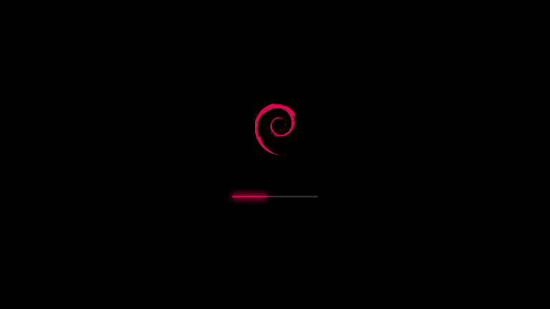

# Debian Slider Plymouth Theme

Plymouth boot splash theme for Debian: the Debian swirl above a thin bar with a
glowing highlight that slides left and right while the system boots and fills
the bar when the boot is done.  The whole splash is scaled to the screen, so it
has the same proportions on a 1366x768 laptop and on a 4K monitor.



## What it shows

| situation                                | on screen                                                                                  |
|------------------------------------------|--------------------------------------------------------------------------------------------|
| boot                                     | swirl, sliding highlight; the whole bar lights up when the display manager starts         |
| shutdown, reboot                         | swirl, sliding highlight; no fill at the end                                               |
| encrypted disk, `plymouth ask-for-password` | swirl stays, the bar is replaced by a box with a lock and one bullet per character; the prompt below, a caps lock warning when it is on |
| `plymouth ask-question`                  | same box, the typed text instead of bullets                                                |
| `plymouth message`, fsck output          | one centred line below the bar (or below the prompt)                                       |
| package, system or firmware updates      | title and subtitle above the swirl, a real progress bar in place of the highlight, percent below |

## Requirements

* `plymouth` and `plymouth-label` (text rendering for prompts, messages and titles)
* `python3` only if you want to re-render the images or run `make check`
* `plymouth-x11` only for previewing the theme from a running desktop

The theme uses the `DejaVu Sans` font, which is the only font family Debian's
initramfs hook copies into the initramfs, so no extra font packages are needed.

## Installation

```shell
git clone https://github.com/nuxster/debian-slider.git
cd debian-slider
sudo make apply-now      # install, set as default, rebuild the initramfs
```

Other targets (`make help` lists them):

| target           | what it does                                                          |
|------------------|-----------------------------------------------------------------------|
| `make check`     | validate the theme files, no root needed                              |
| `make render`    | regenerate `theme/images/` (`RENDER_FLAGS="--color 3b82f6"` for options) |
| `make logo`      | re-render `src/logo.png` from `src/logo.svg` (needs librsvg or ImageMagick) |
| `make install`   | copy the files only; honours `DESTDIR` and `PREFIX`                   |
| `make apply`     | install and set as default without touching the initramfs             |
| `make apply-now` | `apply` and rebuild the initramfs                                     |
| `make uninstall` | remove the theme from `/usr/share/plymouth/themes`                    |
| `make preview`   | show the current default theme for a few seconds                      |

### Preview from X11 or Wayland

```shell
sudo apt install plymouth-x11
sudo make preview                  # PREVIEW_SECONDS=15 to keep it longer
```

To see the password dialog, run in a second terminal while the preview is up:

```shell
sudo plymouth ask-for-password --prompt="Unlock disk"
```

### Debian package

The `debian/` directory builds a `plymouth-theme-debian-slider` package.  The
package only installs the files; pick the theme afterwards with
`plymouth-set-default-theme -R debian-slider`.

```shell
sudo apt install debhelper
dpkg-buildpackage -us -uc -b
sudo apt install ../plymouth-theme-debian-slider_*.deb
```

## How the scaling works

Plymouth's `two-step` module draws images at their pixel size, so a bitmap
theme is large on a small screen and tiny on a large one.  This theme uses the
`script` module instead: `theme/debian-slider.script` lays everything out on a
300x300 "design" canvas and scales that canvas to 30 % of the screen height
(the smallest screen's, if several are connected).  The scale is snapped to
quarter steps, so a 1080p screen gets exactly 1x and a 4K screen exactly 2x
with no resampling at all.  Text is rendered at a font size scaled the same
way.

Scaling one bitmap up looks blurry, so the images are shipped in two sets,
`theme/images/1x` and `theme/images/2x`; the script picks the smallest set that
is not smaller than the wanted size and shrinks it.  The sets are identical in
content, `2x` is exactly twice the size of `1x`:

| file                          | 1x      | what it is                                                   |
|-------------------------------|---------|--------------------------------------------------------------|
| `logo.png`                    | 121x150 | the swirl                                                    |
| `track.png`                   | 250x5   | the bar                                                      |
| `highlight-left/right.png`    | 3x5     | the rounded ends of the highlight                            |
| `highlight-mid.png`           | 1x5     | one column of its middle, stretched to the wanted width      |
| `glow-left/right.png`         | 80x64   | the two halves of the highlight's glow                       |
| `glow-mid.png`                | 1x64    | one column of the glow's flat middle, stretched like the highlight |
| `tail-left/right.png`         | 35x5    | the faint tails the highlight bleeds along the track         |
| `dialog.png`                  | 340x33  | password box with the lock glyph                             |
| `bullet.png`                  | 10x10   | one password bullet                                          |
| `capslock.png`                | 24x28   | caps lock warning                                            |

## How the bar is animated

There are no frame sequences: the script moves and resizes sprites.  The
highlight is three sprites, its two rounded ends and a one pixel column of its
middle that `Image.Scale` stretches to any width; the glow is built the same
way from its two halves and a column of its flat middle.  Sliding the
highlight only moves the sprites (at `refresh_rate` ticks per second, so it
is as smooth as the refresh rate), the end-of-boot fill and the update-mode
progress bar stretch the middle columns, and the result is pixel for pixel
what a rendered frame of that width would be.  The tails are squeezed with
`Image.Scale` when the highlight gets close to an end of the track.

The pieces are shipped as separate files rather than cut from one image at
run time because plymouth's `Image.Crop` blends onto a transparent buffer,
which darkens translucent pixels and would dim the glow.

Plymouth applies its own 2x factor on HiDPI panels (small screens with a very
high pixel density) before the script sees the screen size; that is expected
and the same for every plymouth theme.

## Customising

### Colours and bar

Everything except the swirl is drawn by `tools/render.py`, which needs only
python3.  The swirl is read from `src/logo.png`, a 600 px raster of
`src/logo.svg`; edit the `fill` colour in the SVG and run `make logo` to
recolour it.  Bar colours, size, glow and frame counts are command line
options:

```shell
python3 tools/render.py --help
python3 tools/render.py --color 3b82f6 --bar-color 222222   # blue slider
python3 tools/render.py --scales 1 2 3                      # extra 3x set for huge screens
make check
```

After adding a set, list it in `image_sets` at the top of the script.

### Layout and text

The settings block at the top of `theme/debian-slider.script` holds:

* `canvas_fraction` (0.30): canvas height as a fraction of the screen height
* `scale_step`, `scale_min`: snapping of the scale
* `throbber_period`: seconds for one left-right-left sweep of the highlight
* `refresh_rate`: script ticks per second; the highlight moves every tick
* `end_units`: systemd units whose start ends the boot and fills the bar
* `image_sets`: the `<S>x` directories available under `images/`
* `font_family`, `font_size`, `title_size`, `text_color`
* `titles`: title and subtitle for the update modes
* `design.*`: geometry in design units, must match `tools/render.py`

### Checks

`make check` (`tools/check.py`) verifies the `.plymouth` file, that the script
and every image it references exist, that the pieces of the bar fit together
and that every set is an exact multiple of `1x`.  It runs without plymouth, so
it cannot execute the script; use `make preview` for that.

## Repository layout

```
theme/debian-slider.plymouth   theme descriptor (ModuleName=script)
theme/debian-slider.script     layout, animation, dialog and update-mode logic
theme/images/1x, 2x            rendered image sets
src/logo.svg, src/logo.png     the swirl, vector and 600 px raster
tools/render.py                renders theme/images from src/logo.png
tools/check.py                 validates the theme
tools/pngio.py                 tiny PNG reader/writer used by both
debian/                        Debian packaging
```

## Notes

* Plymouth's `script` module has no end-of-boot hook, and its quit function
  runs only after plymouth has stopped drawing, so nothing drawn there is ever
  seen.  GDM and LightDM also run `plymouth deactivate` the moment they start
  and `plymouth quit --retain-splash` only once the greeter is up, so the
  splash freezes for those seconds.  The theme therefore lights up the whole
  bar when systemd reports `systemd-user-sessions.service` starting, the unit
  every display manager is ordered after (`end_units` in the script also
  lists the display managers themselves as fallbacks).  Only a few dozen
  milliseconds are left at that point, which is why the fill is a single
  frame and not an animation: an animation would freeze half way.  The old
  `two-step` version of this theme could play a long end animation because
  plymouth waits for `two-step`'s end animation before deactivating; the
  `script` module gets no such chance.
* Debian's initramfs hook drops a "Debian NN" wordmark into `two-step` themes
  only; this theme is not affected.
* The `script` module cannot show the keyboard layout indicator that
  `two-step` themes have; only the caps lock warning is shown.
* Plymouth's `script` module draws one set of sprites and shows it centred on
  every monitor, so the splash cannot be sized per screen.  The theme sizes it
  for the *smallest* screen: with a 4K and a Full HD monitor both get the 1x
  layout, which is small on the 4K but does not overflow the Full HD one.

## License

Code and configuration are under the MIT license.  The Debian swirl is the
Debian Open Use Logo, licensed under the LGPL-3+ or CC-BY-SA 3.0.  See
[LICENSE](./LICENSE).  Debian is a registered trademark of Software in the
Public Interest, Inc.; this theme is not affiliated with the Debian project.
